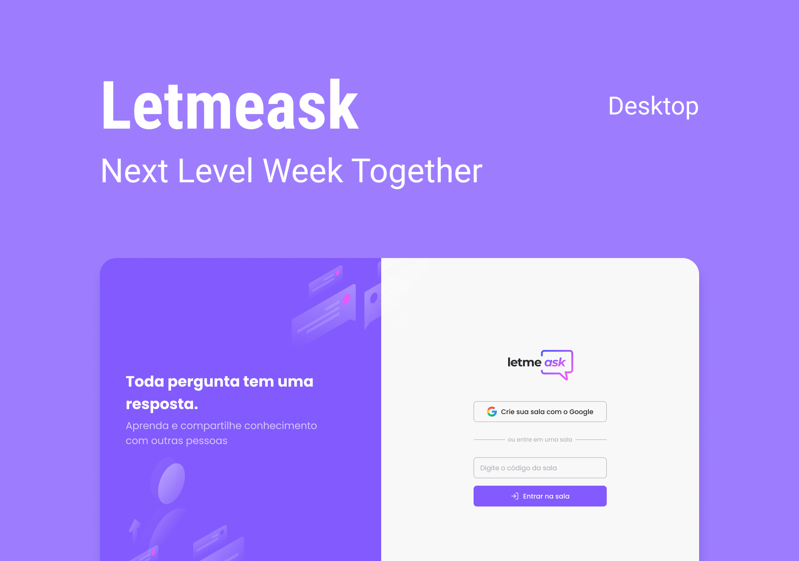

<h2 align="center">
            
</h2>

<p align="center">

<a href="https://www.linkedin.com/in/jessica-zimmerhansl">
    
  </a>   
     <a href="https://github.com/jlzimmerhansl/LetMeAsk">
    
  </a>    
                                                                                                         
  <a href="https://github.com/jlzimmerhansl/LetMeAsk/commits/master">
    
  </a>

  <a href="https://github.com/jlzimmerhansl/LetMeAsk">
    
  </a> 
</p>

## :bookmark: About the Project

Project develope during the 6° Next Level Week, provided by [RocketSeat][url-rocket] :rocket:

## :art: Layout

Web layout is availabe in [Figma][url-figma-web]

<h2 align="center">
            
</h2>

## :hammer_and_pick: Technologies

This project was developed using the following technologies:

- [Node][url-node]
- [ReactJS][url-react]
- [TypeScript][url-typescript]
- [Firebase][url-forebase]

## :gear: How to use?

> :bulb: The web and mobile version depends on the server is running for its operation.

This project is divided in three parts:

1. Web
2. Mobile
3. Backend

## :mechanic: What do you need to use?

- [Git][url-git]
- [NodeJS][url-node]
- [Expo][url-expo]

## :package: How to clone?

```bash
# clone the repository
$ git clone https://github.com/jlzimmerhansl/LetMeAsk.git
```

## :rocket: How to run?

```bash
# install the dependencies
$ yarn

# run the project
$ cd LetMeAsk
$ yarn start
```

## :clipboard: Licence

This project is licensed under the MIT Licence. See [License][url-license] file for details.

---

<h4 align="center">
Made with :purple_heart: &nbsp; by <a href="https://www.linkedin.com/in/jessica-zimmerhansl" target="_blank">Jessica Zimmerhansl</a>
</h4>

[url-typescript]: https://www.typescriptlang.org
[url-node]: https://nodejs.org/pt-br/
[url-react]: https://reactjs.org
[url-git]: https://git-scm.com
[url-diego]: https://github.com/diego3g
[url-figma-web]: https://www.figma.com/file/vJ5TSqA05OIT1IJ1X3Kgaa/Letmeask-Copy?node-id=45%3A3279
[url-rocket]: https://rocketseat.com.br
[url-forebase]: https://firebase.google.com/
[url-license]: https://github.com/jlzimmerhansl/LetMeAsk/blob/master/LICENSE
